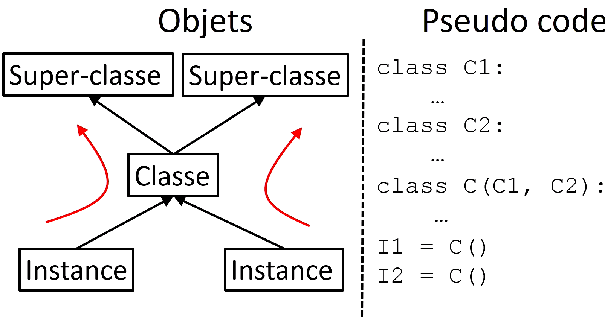
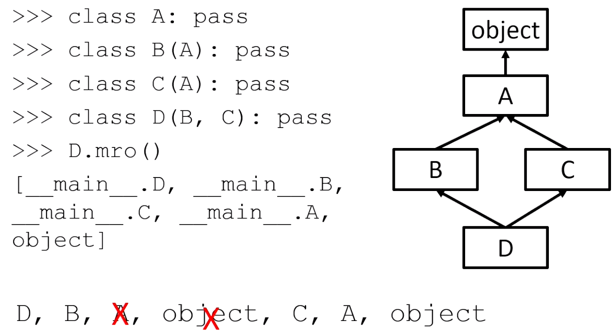

# 7. Semaine 6. Conception des classes

Ce qu'il faut connaitre :

* Cours 7.1
  * Arbre d'héritage - Classes/Instances

  * La méthode Bound

  * Encapsulation

  * Le type Properties


[TOC]

## 7.1 Classes, instances et méthodes

La programmation objet est un paradigme de programmation qui vient au prix d'un effort de conception supplémentaire.  Cependant, comme en Python tout est un objet, on peut très rapidement tirer pleinement parti de ce paradigme de programmation. Avant de pouvoir le maitriser, il faut connaitre un certains nombre de notions : **la notion de classe, d'instance, de méthode, la notion de méthode spéciale et la notion d'héritage**. Nous allons également voir qu'en exploitant ce paradigme nous pouvons créer nos propres itérateurs, exceptions et également nos propres Context Managers.

Nous savons qu'en Python tout est objet, les caractéristiques de chaque objet sont définies par leur type. Il y'a en Python les types built-in qui sont très puissants mais qui ne peuvent pas couvrir tous nos besoins. C'est pourquoi il y'a le concept de classe. Une classe en Python permet de définir nos propres types, les classes étant des objets, on va les appeler et créer de nouvelles instances. On va dire **qu'il y'a une relation d'héritage entre l'instance et la classe.** L'instance va pouvoir hériter de tous les attributs de classe. On dira de plus que **la classe est une usine à instance**, i.e. qu'à partir d'une classe on peut faire autant d'instance qu'on veut.

Cette notion d'héritage est liée à la notion d'espace de nommage. La classe et l'instance ont leurs propres espaces de nommage. Si on recherche un attribut dans l'instance, et qu'on ne le trouve pas on remontera l'arbre d'héritage, ce qui revient à le chercher dans la classe.

### 7.1.1 Illustration de la relation d'héritage entre Instance et Classe:

On peut noter que la classe et l'instance auront chacun leurs propres espace d'adresse

```python
class Phrase:
    ma_phrase = "je fais un mooc sur python"
    
>>> Phrase
<class __main__.Phrase at 0x0000000002AB9888>
>>> p = Phrase() # on produit une instance
>>> p
<__main__.Phrase instance at 0x0000000002B95B48>
```

On peut **accéder à l'espace de nommage de deux façons**, soit avec méthode spéciale ou soit avec une fonction builtin. On dit que, l'attribut module référence main, ce qui veut dire que la classe est dans le module main

```Python
>>> Phrase.__dict__ # Avec méthode spéciale
mappingproxy({'__module__': '__main__', '__doc__': None, 'ma_phrase': 'je fais un mooc'})
>>> vars(Phrase) # Avec une fonction built-in
mappingproxy({'__module__': '__main__', '__doc__': None, 'ma_phrase': 'je fais un mooc'})
```

Regardons maintenant l'espace de nommage de notre instance, on rappelle que lorsqu'on crée l'instance l'espace de nommage est vide. Mais, il y'a une relation d'héritage avec la classe, donc si on cherche un paramètre il remontera l'arbre d'héritage vers la classe.

```python
# Lorsqu'on cree une instance l'espace de nommage est vide
>>> vars(p)
{}
```

Regardons cela, en cherchant ma_phrase alors qu'elle n'existe pas :

```python
>>> p.ma_phrase
"je fais un mooc sur python"
```

### 7.1.2 Mutabilité des classes et instances:

Les classes et les instances sont des objets mutables et la résolution des attributs le long de l'arbre d'héritage est fait de manière dynamique en fonction de l'état des espaces de nommage au moment où on fait la résolution de l'attribut.

Regardons un exemple, qui va découper la phrase en mots, puis on va essayer d'accéder à ce nouvel attributs avec notre instance - ```p``` :

```python
>>> Phrase.mots = Phrase.ma_phrase.split()
>>> Phrase.mots
['je', 'fais', 'un', 'mooc', 'sur', 'python']
>>> p.mots
['je', 'fais', 'un', 'mooc', 'sur', 'python']
>>> vars(Phrase)
mappingproxy({'__module__': '__main__', 'mots': ['je', 'fais', 'un', 'mooc'], '__doc__': None, 'ma_phrase': 'je fais un mooc'})
>>> vars(p)
{}
```

### 7.1.3 Ajout de méthodes dans la classe:

Lorsqu'on défini une classe, on définit des comportements dont vont hériter nos instances. Pour l'instant nous n'avons aucun comportement, nous avons uniquement un seul attribut. **Comportement = méthodes**.

Les méthodes sont capable de travailler sur les attributs de l'instance, regardons cela. On note que la méthode prend deux arguments ```self``` et ```ma_phrase```. Lorsqu'on appelle une méthode sur une instance, la référence de l'instance va être automatiquement le premier argument. **La variable self va référencer mon instance**

```python
s = "je fais un mooc sur python"
class Phrase:
    def initia(self, ma_phrase):
        self.ma_phrase = ma_phrase
        
>>> p = Phrase()
>>> p.initia(s)
>>> vars(p) # on regarde son espace de nommage
{'ma_phrase': 'je fais un mooc sur python'}
```

### 7.1.4 Comment Python fait pour passer automatiquement l'instance ? La méthode Bound

C'est via un mécanisme de fonction appelé ```"Function Bound"```. Regardons ce que ça veut dire :

```python
>>> Phrase.initia
<function Phrase.initia at 0x0000e521821e8>
>>> p.initia
<bound method Phrase.initia of <__main__.Phrase object at 0x0001D05181D0>>
```

On voit que lorsqu'on appelle l'objet sur notre instance, nous avons un objet bound. Cela signifie que c'est une fonction qui est liée à l'instance et lors de l'appel, Python va automatiquement passer l'instance comme premier argument. Donc, c'est le fait qu'on appelle cette fonction sur l'instance qui créer cet objet particulier et qui indique à Python qu'on doit lui passer l'instance comme premier argument.

Suite à ce qu'on vient de dire les deux écritures suivantes sont équivalentes :

```python
>>> p.initia(s)
>>> Phrase.initia(p, s) 
```

### 7.1.5 Encapsulation ...

### 7.1.6 Les properties ...

### 7.1.7 Faire communiquer un code Python et un autre


## 7.2 Les méthodes spéciales

Nous avons vu dans la vidéo précédente que nous pouvions définir des méthodes sur les classes. C'est quelque chose de tout à fait classique, les classes définissent en général un certain nombre de méthodes que l'on utilise pour manipuler les attributs des instances. Cependant, je vous avais également expliqué que, en Python, une caractéristique des classes, c'est qu'on peut créer nos objets qui se manipulent exactement comme des types built-in. Regardons une illustration de ça :

Toutes les opérations que nous définissons ci-dessous, peuvent être implémenter dans notre classe ```Phrase``` avec ce qu'on appelle les **méthodes spéciales**.

```python
>>> p = Phrase("je fais un mooc sur python")
>>> len(p) 
>>> m in p # Test d'appartenance <=> __contains__()
>>> p[2]
>>> print(p) # __str__
>>> p1 + p2 # Concatenation de deux objets phrases
```

Les méthodes spéciales commencent toutes et finissent toutes par un double underscore et sont appelés automatiquement lorsque l'on utilise par exemple une fonction built-in.

```python
s = "je fais un mooc sur python"
class Phrase:
    def __init__(self, ma_phrase):
        "__init__ est appelé par abus de langage constructeur en Python"
        self.ma_phrase = ma_phrase
        self.mots = ma_phrase.split()
    def nb_lettres(self):
        return len(self.ma_phrase)
    def __len__(self):
        "On va compter le nombre de mots"
        return len(self.mots)
    def __contains__(self, mot):
        "Le test d'appartenance doit retourner un boolean"
        return mot in self.mots
    def __str__(self):
        "Utile pour le débuggage ou lors de l'exécution du programme"
        return " ".join(self.mots)
    
>>> p = Phrase(s)
>>> len(p)
6
>>> 'mooc' in p
True
>>> print(p)
"je fais un mooc sur python"
```

Nous venons de voir les méthodes spéciales et nous avons vu que ces méthodes spéciales permettent de créer vos propres classes qui se comportent comme des types built-in. Il existe une centaine de méthodes spéciales que nous verrons en complément. Il faut aussi savoir que ces méthodes spéciales peuvent définir ce qu'on appelle un Protocole, notamment ```le protocole d'itération``` et ```le protocole de Context Manager``` que nous aborderons dans une prochaine vidéo.

### 7.2.1 XXX


## 7.3 Héritage

il y'a relation d'héritage entre l'instance et la classe qui crée l'instance. Lorsqu'on cherche un attribut dans une instance, si on ne le trouve pas dans l'espace de nommage on remonte l'arbre d'héritage et on arrive dans la classe. Cette notion d'arbre s'étends aux classes, ce qu'on illustre: (Les flèches en rouge indiquent qu'on remonte l'arbre si on ne trouve pas l'attribut dans le nœud courant):



La classe C va hérité de C1 et C2, c'est une sous classe de ces deux éléments.

Nous allons reprendre le code du cours précédent, avec quelques modifications sur le string s :

```python
s = "je fais un MOOC sur python"
class Phrase:
    def __init__(self, ma_phrase):
        self.ma_phrase = ma_phrase
        self.mots = ma_phrase.split()
    def nb_lettres(self):
        return len(self.ma_phrase)
    def __len__(self):
        return len(self.mots)
    def __contains__(self, mot):
        return mot in self.mots
    def __str__(self):
        return "\n".join(self.mots)
```

On voudrait faire un test d'appartenance qui ne prenne pas en compte la casse (qu'on a rajouté avec MOOC en majuscule), ce qu'on fait en surchargeant la méthode ```__contain__``` . On peut le faire avec une relation d'héritage, car la classe va hériter de toutes les méthodes de ```Phrase```. Si on veut en modifier une on va **surcharger** deux méthodes de **Phrase**, et l'appel de ```__init__``` de ```Phrase``` ne sera plus appelé automatiquement. (on va quand même le forcer en ligne 1 de la méthode spéciale)

```python
class PhraseSansCasse(Phrase):
    def __init__(self, ma_phrase):
        Phrase.__init__(self, ma_phrase) # ici on force l'initialisation
        self.mots_lower = {m.lower() for m in self.mots}
    def __contains__(self, mots): # on surcharge la fonction
        return mot.lower() in self.mots_lower
```

Après avoir crée la classe, on fait quelques tests pour vérifier que la relation d'héritage tient avec ```isininstance()```. Cette méthode vérifie que notre instance est un élément de notre classe ou d'une autre qui vient de l'arbre d'héritage.

```python
# Vérification de l'héritage
>>> p_no = PhraseSansCasse(s)
>>> isinistance(p_no, Phrase)
True
>>> isinistance(p_no, PhraseSansCasse)
True
# Test avant/arpès surcharge de __contains__
>>> p = Phrase(s) # avant, avec casse
>>> 'mooc' in p
False
>>> 'Mooc' in p_no # après, sans casse
True
>>> 'mooc' in p_no
True
```

Nous avons vu qu'on peut avoir de l'héritage multiple, dans quel ordre va ton faire la recherche ? C'est ce qu'on appelle la ```Method Resolution Order (MRO)``` ou ```Ordre de Resolution des Attributs```. On l'abordera dans un prochain cours.

### 7.3.1 XXX


## 7.4 Héritage multiple et ordre de résolution des attributs (MRO)

Lorsqu'on cherche un [attribut](https://fr.wikipedia.org/wiki/Attribut_(informatique)) on appelle ca la recherche d'attribut mais également **la résolution d'attribut**, le mécanisme de recherche remonte l'arbre d'héritage. Python supporte aussi l'héritage multiple qui va rajouter une couche de difficulté, nous allons avoir un Graphe Acyclique, il faut définir une méthode de résolution des attributs qui va suivre un parcours dans ce graphe d'héritage.

**Illustrons ça :**

On veut savoir, comment Python fait pour savoir quel est la classe qui a crée l'instance et quels sont les super classe de ma classe, il existe des attributs spéciaux :

* `__class__` retourne une référence de l'objet classe qui a crée cette instance
* Les classes ont un attribut ```__bases__``` qui est un tuple qui contient toutes  les super classes de la classe. En Python  une classe hérite par défaut de la classe ````object``` si elle n'a pas de super classe, la `classe object` sera toujours hérité, car c'est elle qui défini les fonctions par défaut comme print ...
* et ```mro()``` est une liste qui donne l'ordre de résolution des attributs lorsqu'on arrive dans la classe. On commence par le chercher dans l'espace de nommage de ```C```, puis de ```object```

```python
class C:
    pass

>>> c = C()
>>> c.__class__
__main__.C
>>> c.__bases__
(object,)
>>> c.mro() 
[__main__.c, object]
```

 **Cas 2 :**

Voyons un cas un peu plus compliquer, pour regarder l'ordre de résolution des attributs

```python
class superA:
    pass
class superB:
    pass
class C(superA, superB):
    pass

>>> c.mro()
[__main__.c, __main__.superA, __main__.superB, object]
```

Modifions la classe C; on voit que l'ordre des classes a une importance dans la résolution des attributs.

```python
class superA:
    pass
class superB:
    pass
class C(superB, superA):
    pass

>>> c.mro()
[__main__.c, __main__.superB, __main__.superA, object]
```

 **L'algorithme MRO**:

On va définir une classe A qui n'hérite de personne, donc par défaut de object. Une classe B et C qui vont hériter de A et enfin une classe D qui est sous classe de B et C.

On a ce qu'on appelle **un diagramme en diamant**. Python va utiliser un algorithme MRO: on va parcourir les classes de bas en haut et ensuite de gauche a droite,  donc **D->B->A->object** et on redescend **C->A-> object**. Ensuite si on a des classes dupliqués ont les enlèves sauf les dernières.



### 7.4.1 XXX


## 7.5 Variables et attributs

Nous avons vu la **notion de portée de variable** (dans le contexte des fonctions et des modules) et **recherche d'attribut** le long des arbres d'héritage tout ces mécanismes servent a savoir dans quel espaces de nommages faut-il chercher nos attributs ou variables. Il est probable que pour l'instant vous n'ayez pas les idées très claires sur comment ces différents mécanismes interagissent.

Le but de ce cours est de faire la lumière sur les mécanismes de référencement et d'affectation des variables et des attributs quel que soit le contexte.

**<u>Distinction entre les notions de variable et d'attribut</u>**:

*Définitions :*

* **Variable :** lorsqu'un nom est référencé ou affecté directement.

```python
>>> x = 10
>>> print(x)
```

* **Attribut :** lorsque ce nom est référencé ou affecté en utilisant la notation objet point.

```python
>>> objet.x = 10 
>>> print(objet.x) 
```

**<u>Pourquoi cette distinction ? On utilise des mécanismes différents pour la recherche des noms</u>:**

* **Variable :** On utilise un mécanisme qui s'appelle <span style="color:darkblue">**la liaison lexicale**</span>, c'est un mécanisme statique qui est défini à l'écriture de notre programme.
* **Attribut :** la recherche de ce nom va être fait en utilisant un mécanisme de <span style="color:darkgreen">**la résolution d'attribut**</span>

Ces mécanismes de recherche on pour but de savoir *dans quel espace de nommage ce nom a été défini*.

**<u>Exemples</u>:**

- **Attribut :** (cas plus simple). On commence par affecter (ou définir) la valeur 10 à ```l'objet x```. On va dire que ce nom ```x``` doit être défini dans l'espace de nommage de mon objet. Donc, ce nom ```x``` va référencer l'entier 10 dans l'espace de nommage de objet. Lorsqu'on référence mon attribut ```x```, on veut dire qu'on va chercher notre attribut dans l'espace de nommage de objet.

```python
# Le nom x va référencer l'entier 10 dans l'espace de nommage de objet
>>> objet.x = 10 
>>> print(objet.x) 
```

Mais, on aura deux cas différents suivant la nature de objet.

1. Si ```objet``` est un **module**, une référence du nom ```x``` dans l'objet veut dire qu'on va chercher ```x``` dans l'espace des variables globales de notre module (l'espace de nommage de module). On cherche dans l'espace de nommage de ```module```

2. Si ```objet``` est une **classe ou une instance** on va chercher ```x``` le long de l'arbre d'héritage. On cherche dans l'espace de nommage courant, donc de notre objet, si on ne le trouve pas on remonte l'arbre.

- **Variable :**

  On dit qu'une variable est <span style="color:red">**défini**</span> dans un bloc de code d'une <span style="color:darkblue">**fonction**</span>, d'une <span style="color:darkblue">**classe**</span> ou d'un <span style="color:darkblue">**module**</span>, lorsqu'elle est écrite directement dans le bloc de code de la fonction, de la classe ou du module. Dans ce cas la, on dit qu'elle devient **locale à ce bloc de code**.

  Les variables sont liées aux espaces de nommage statiquement en fonction de là où elles sont écrites au moment de l'écriture de notre programme avec le mécanisme de <span style="color:darkblue">**la liaison lexicale**</span>.

  La seule exception est lorsqu'on déclare notre variable ```global``` ou ```nonlocal```.

**<u>Les différentes manières de faire une <span style="color:red">définition</span> sur les variables</u>:**

On a différentes manières de faire une définition, on dit également une liaison d'une variable. C'est-à-dire une liaison entre un nom de variable et un objet. (Il y'a aussi les boucles for, imports ...)

**Vocabulaire: **

* <span style="color:darkblue">**La liaison**</span> : c'est le mécanisme qui lie une variable à un bloc de code.
* <span style="color:darkblue">**La référence**</span>. : c'est le mécanisme qui associe une variable à un objet

Si on pose ```x=1```, ça va permettre à la fois à la variable ```x``` de référencer l'objet 1, mais également de lier la variable ```x``` au bloc de code dans lequel elle est déclarée.

* **Affectation explicite :**

```python
>>> x = 1
```

* **Déclaration** de paramètres dans une entête de **fonction**:

Le paramètre ```a``` est une variable locale liée au bloc de la fonction

```python
>>> def f(a):
```

* Les **définitions de classes et de fonction :**

```python
>>> class C()
>>> def f()
```

**<u>Le Référencement sur les variables - Le cas spéciale des classes</u>:**

Lorsqu'on fait un ```print(x)```  on va appliquer la règle **LEGB**, on va chercher la variable localement à la fonction, si non défini, on remonte dans les fonctions englobantes, ensuite, on va dans le module et finalement dans le module builtins.

Dans le **cas des classes** il y'a un cas particulier à prendre en compte, **le bloc de code des classes est systématiquement sauté** lors de la résolution des attributs. Le bloc de code des classes est très particulier. Une variable définie dedans n'est pas accessible en dehors de la classe ni aux méthodes de classe.

Ce choix architectural a été fait pour éviter d'avoir une interaction bizarre entre le mécanisme de résolution d'attribut et le mécanisme de recherche des variables. Les classes et les instances sont naturellement construites pour rechercher des attributs le long des arbres d'héritage, c'est pour ça qu'on a ce mécanisme lorsqu'on définit les variables dans les classes.

**<u>Cas 1</u>:**

La question qu'on veut répondre est, que va afficher ```print(a)```. On sait que les variables définies dans les fonctions sont locales à la fonction, et que les variables définies dans les classes ne peuvent pas être vues en dehors de la classe. On aura donc la variable globale. Si on utilise la règle **LEGB**, a n'est pas défini dans une fonction, pas défini dans une fonction englobante, elle est définie globalement.

```python
# fichier spam.py
a = 1
def f():
    a = 2  
class C():
    a = 3

>>> f()
>>> ins = C()
>>> print(a) # qu'affiche print(a) ? la variable globale a, l'entier 1
1
```

**<u>Cas 2</u>:**

On veut savoir ce que va afficher ```print(a)```, on regarde avec la règle **LEGB**, comme en haut elle est défini globalement donc elle vaut 1. On voit que dans ce mécanisme on a sauté le bloc de code de la classe.

Dans le second cas, ```print(C.a)``` on a un mécanisme de <span style="color:darkgreen">**résolution d'attribut**</span>. Est-ce que ```C``` est un module ou une classe ? C'est une classe, on va chercher le long de l'arbre d'héritage. ```C.a``` est défini dans l'espace de nommage de notre classe donc il vaut 2. Sinon on aurait remonté l'arbre d'héritage.

```python
# fichier spam.py
a = 1    
class C():
    a = 2
    def f(self):
        print(a)
        print(C.a) # on a une resolution d'attribut
        # C est une classe on va le chercher dans l'arbre d'heritage

>>> ins = C()
>>> ins.f()
>>> print(a) # meme question 
1
>>> print(C.a) # On change de mécanisme, on a une résolution d'attribut
2
```

**<u>Cas 3</u>:**

On veut savoir ce que va afficher ```print(a)```, on le cherche avec **LEGB**, est-elle défini localement à la fonction, non, on n'a pas de fonction englobante. On saute tous les blocs de code des classes. Elle est définie globalement, on prend la variable qui référence 1.

```python
# fichier spam.py
a = 1    
class A():
    a = 2
    class B:
        def f(self):
            print(a)
            print(C.a) # on a une resolution d'attribut
            # C est une classe on va le chercher dans l'arbre d'heritage

>>> ins = A.B()
>>> ins.f()
>>> print(a) # meme question 
1
```

Il est important de comprendre que la recherche d'attributs utilisent des mécanismes complètement différents. **La recherche des variables utilise un mécanisme statique** , la liaison lexicale qui est déterminée au moment de l'écriture du programme. Tandis que la **recherche d'attribut est dynamique** en fonction de l'exécution de notre programme. Tout ces mécanismes servent à trouver des noms dans des espaces de nommage.

### 7.5.1 XXX


## 7.6 Conception d'iterateurs

Nous avions vu les notions d'itérables et d'itérateurs, les itérateurs permettent de parcourir les objets de manière simple, on rappelle leurs définitions :

**<u>Rappels sur les itérables et les itérateurs</u>:**

* **Itérable :** c'est un objet qui a une méthode ```__iter__``` qui retourne un itérateur
* **Itérateur :** c'est un objet qui a une méthode ```__iter__``` qui se retourne lui-même et qui a une méthode ```__next__``` qui à chaque fois qu'on l'appelle va retourner un nouvel élément, jusqu'à ce qu'il n y en ait plus. Quand il n'y a plus d'éléments on a une exception qui s'appelle ```StopIteration```.

**<u>Comment implémenter nos propres itérables et itérateurs</u>:**

* Implémentation de la classe ```Phrase``` comme un itérateur

Nous allons voir comment les créer avec nos propres objets. Nous allons en voir 3 manières différentes de concevoir un objet qui est soit un itérateur, soit un itérable.

On va voir comment définir un objet de Phrase comme un itérateur. On rappelle qu'un itérateur a deux méthodes, on va lui rajouter une méthode ```__iter__``` et ```__next__``` dont on va vouloir qu'elle itéra naturellement sur les mots de la phrase jusqu'à ce qu'elle soit vide.

```python
s = "je fais un mooc sur python"
class Phrase:
    def __init__(self, ma_phrase):
        self.ma_phrase = ma_phrase
        self.mots = ma_phrase.split()
    def __iter__(self):
        return self
    def __next__(self):
        if not self.mots:
            raise StopIteration
        # pop : retourne le 1er mot de la liste puis le supprime
        return self.mots.pop(0) 
    
>>> p = Phrase(s)
>>> [m for m in p]
['je', 'fais', 'un', 'mooc', 'sur', 'python']
>>> [m for m in p]
[] # l'iterateur est vide, car on a défini un itérateur qu'on ne peut parcourir qu'une seule fois
>>> next(p)
StopIteration
```

- Implémentation de la classe ```Phrase``` comme un itérable, i.e. comme objet qu'on est capable de parcourir de multiples fois.

Cette fois-ci la méthode spéciale ```__iter__``` au lieu de se retourner soit-même devra retourner un objet itérateur sur ```Phrase```

**(1)** On doit faire une shallow copy, car la méthode __next__ va faire un pop sur les mots. Ce qui veut dire qu'elle va modifier l'objet référencé par mots. Si on référençais l'objet qui est contenu dans la classe Phrase, ça voudrait dire qu'une fois que l'itérateur a parcouru une fois la liste des mots l'attribut mot référencerait une liste vide. Pour être sur de pouvoir itérer de multiples fois sur la liste de mots, il faut faire une copie qu'on va petit à petit réduire.

```python
s = "je fais un mooc sur python"
class Phrase:
    def __init__(self, ma_phrase):
        self.ma_phrase = ma_phrase
        self.mots = ma_phrase.split()    
     def __iter__(self):
        return IterPhrase(self.mots)
    
class IterPhrase:
    def __init__(self, mots):
            self.mots = mots[:] # note: (1)
    def __iter__(self):
            return self
    def __next__(self):
        # on veut que a chaque tour de boucle on a un mot nouveau
        if not self.mots:
            raise StopIteration
        return self.mots.pop(0) 
    
>>> p = Phrase(s)

# à chaque fois qu'on va appeler la liste on aura un nouvel itérateur
>>> [m for m in p]
['je', 'fais', 'un', 'mooc', 'sur', 'python']
>>> [m for m in p]
['je', 'fais', 'un', 'mooc', 'sur', 'python']

# On peut le remarquer ici en regardant leurs adresses
>>> iter(p)
<__main__.IterPhrase object at 0x000E11818EFEFE>
>>> iter(p) # on obtient deux iterateurs differents
<__main__.IterPhrase object at 0x002148888222FFFFE>
```

**<u>On n'a pas besoin d'écrire une classe itérateur IterPhrase</u>:**

On rappelle qu'on avait vu la notion de **fonctions génératrices** dont leurs but est de **créer des itérateurs**. A chaque fois qu'on appelle une fonction génératrice, on va générer un nouvel itérateur. On va utiliser leurs capacités pour réduire l'écriture d'une fonction itérable :

```python
s = "je fais un mooc sur python"
class Phrase:
    def __init__(self, ma_phrase):
        self.ma_phrase = ma_phrase
        self.mots = ma_phrase.split()
        
     def __iter__(self):
        # on a defini une classe Phrase iterable
        for m in self.mots:
            yield m
    
>>> p = Phrase(s) # on obtient bien la meme fonctionalites
# On peut parcourir la liste autant qu'on veut
>>> [m for m in p]
['je', 'fais', 'un', 'mooc', 'sur', 'python']
>>> [m for m in p]
['je', 'fais', 'un', 'mooc', 'sur', 'python']
# On a une fonction génératrice qui est produite automatiquement
>>> iter(p)
<generator objet Phrase.__iter__ at0x252158FCDR>
>>> iter(p)
<generator objet Phrase.__iter__ at0x1875AQZERR>
```

### 7.6.1 XXX


## 7.7 Conception d'exceptions personnalisées

Nous allons voir comment créer nos propres exceptions. A quoi ça sert de créer ses propres exceptions ? D'abord de voir que c'est extrêmement simple, essentiellement deux lignes de code et surtout d'avoir une exception qui corresponde exactement à notre besoin.

En Python **toutes les exceptions qu'on créer doivent hériter de la ```classe Exception``` ou alors d'une de ses sous-classes**. Nous verrons que <span style="color:darkgreen">**les exceptions créent un arbre d'héritage**</span>.

**<u>Début du code</u>:**

On va reprendre la ```class Phrase``` en lui rajoutant un mécanisme de contrôle, qui permet de vérifier qu'on créer bien une Phrase avec un contenu. Cette exception ne veut pas dire que le programme va s'arrêter c'est une manière de communiquer.

```python
s = "je fais un mooc sur python"
class Phrase:
    def __init__(self, ma_phrase):
        self.ma_phrase = ma_phrase
        if not ma_phrase:
            raise PhraseVideError('phrase vide', 18) # on créer une instance de l'exception
        self.mots = ma_phrase.split()
```

Une exception est une classe, qu'on va pouvoir créer. Il est important de :

* Lui donner un nom explicite
* De toujours finir l'exception par le mot Error (PhraseVideError) pour rendre clair que c'est une erreur
* On la fait hériter de la ```classe Exception```
* Dans la majorité des cas, on n'a pas besoin de mettre de contenu à l'intérieur

```python
class PhraseVideError(Exception):
    pass
```

On lance une exception avec une chaîne vide. On a exactement l'endroit où c'est produit cette exception et sa cause. Dans la classe Phrase on va faire deux modifications :

* **Version 1 : ** ```raise PhraseVideError()```
* **Version 2 :** ```raise PhraseVideError('phrase vide', 18)``` on rajoute des arguments; un message d'erreur et un code d'erreur.

```python
>>> p = Phrase(s)
>>> p.mots
['je', 'fais', 'un', 'mooc', 'sur', 'python']
# version 1 :
>>> p = Phrase('')
Traceback (most recent call last):
  File "<stdin>", line 1, in <module>
  File "<stdin>", line 5, in __init__
__main__.PhraseVideError: ('')
    
# on va pouvoir rajouter des arguments dans l'exception qui vont etre mis dans un tuple
# on rajouter 18 comme code d'erreur (le 18  a ete invente par nous)
>>> Phrase('')
Traceback (most recent call last):
  File "<stdin>", line 1, in <module>
  File "<stdin>", line 5, in __init__
__main__.PhraseVideError: ('phrase vide', 18)
```

On va regarder comment manipuler le nouveau ```tuple()``` qui a été rajouté dans l'exception

```python
>>> try:
>>>    Phrase('')
>>>    # le 'e' va référencer l'instance de l'objet exception
>>> except PhraseVideError as e:
>>> print(e.args)
('phrase vide', 18)
```


## 7.8 Conception de Context Manager

En programmation, il est courant de devoir faire des opérations de finalisation. Par exemple, lorsqu'on a un ```objet fichier``` dont on a plus besoin, on doit le fermer; lorsqu'on a un socket on peut vouloir le fermer etc. L'idée c'est de libérer des ressources quand on n'a plus besoin de cet objet.

Ces opérations de finalisation doivent être faites même si on a une exception en cours d'exécution. Si le programme plante, on pourra finaliser nos objets, avant que le programme ne s'arrête définitivement. I=On fait ça avec ```try: <bloc de code> finally:<bloc de code>```.

Regardons la syntaxe d'un Context Manager :

```python
with expression as x:
    <bloc de code>

## Descriptif ##
# Etape 1:
expression -> obj # expression va retourner un objet, cet objet implémente un protocole de Context Manager.
# Etape 2: On retourne un objet qui va être réferencé par la variable 'x'
obj.__enter__() 
# Etape 3: On évalue le bloc de code
# Etape 4: En sortie ou si exception on va appliquer une fonction exit
obj.__exit__()
```

Illustration en Python avec une classe timer qui va calculer le temps dans un bloc with

**<u>Début du code</u>:**

Illustrons la construction d'un ```Context Manager``` avec une classe qu'on va appelé ```Timer```. On va chercher à évaluer le temps d'exécution d'un bloc de code, qui est à l'intérieur d'une ```instruction with```.

On va implémenter le protocole de context manager, avec les deux méthodes:

* ```__enter__``` 
* ```__exit__```: elle doit retourner un booléen, (False ou True). 
  * Si False, ça veut dire qu'en cas d'exception, mon exception va être remontée et va faire arrêter le programme. **Bonne pratique, de laisser remonter les exceptions**.
  * Si True, l'exception va être capturée par l'instruction ```with```, par conséquent, l'exception ne sortira pas

```python
import time

class Timer:
    def __enter__(self):
        # time.time() donne le temps courant
        self.start = time.time()
        return self
    # La méthode doit retourner un boolean si False on remonte l'exception et on arrête
    # Avec True l'exception ne sortira pas elle sera bloqué dans le with
    def __exit__(self, *args):
        duree = time.time() - self.start
        print(f"{duree}s")
        return False
    # Cette méthode permettra de donner un temps intermédiaire d'exécution
    def __str__(self):
        duree = time.time() - self.start
        return f"intermediaire: {duree}s"
```

**<u>Cas 1</u>:**

```python
>>> with Timer() as t:
>>>     sum(x for x in range(10_000_000))
>>>     print(t)
>>>     sum(x**2 for x in range(10_000_000))
49999995000000
intermediaire: 0.6297132968902588s
333333283333335000000
4.1429243087768555s
```

**<u>Cas 2</u>:**

On va rajouter une exception. On remarque que le temps intermédiaire est très proche du temps final, puisqu'on a une exception. On voit que la méthode ```__exit__``` a bien été appelé.

```python
>>> with Timer() as t:
>>>     sum(x for x in range(10_000_000))
>>>     print(t)
>>>     1/0 # on rajoute une erreur
>>>     sum(x**2 for x in range(10_000_000))
49999995000000
intermediaire: 0.6431088447570801s
0.6441569328308105s
Traceback (most recent call last):
  File "<stdin>", line 4, in <module>
ZeroDivisionError: division by zero
```

Le Context Manager est extrêmement pratique pour implémenter dans nos propres objets, les opérations de finalisation et laisser au protocole de Context Manager, le soin de faire ces opérations pour l'utilisateur.

Nous verrons que les décorateurs sont très proche de ce gestionnaire.


