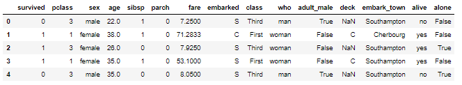
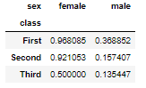
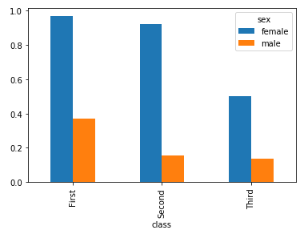

# Semaine 7. L'écosystème data science Python

Opérations avancés en Pandas :

* map(), apply(), filter()


[TOC]

## 1. Présentation générale

Diagramme de Drew Conway - Venn Diagram

Les briques de bases du bloc Data science ont été crée à des dates différentes:

* 1994 Python 1.0
* 2006 NumPy 1.0
* 2008 début de pandas

En terme de Philosophie il y'a de grandes différences. Python est un langage qui dès le départ a eu comme objectif la simplicité. Cette simplicité vient avec un prix à payer celui de faire certains types d'optimisation.

Alors que NumPy et Pandas ont dès le départ étant pensé avec pour objectif l'efficacité, ce qui implique une perte de souplesse et de simplicité.

**<u>L'intérêt de la librairie NumPy</u>:**

On va comparer la performance avec trois méthodes 

```python
import numpy as np
import pandas as pd
import seaborn as sns
import matplotlib.pyplot as plt
%matplotlib inline

>>> L = list(range(1000))
>>> a = np.array(L)
# On compare la performance sur une liste classique et une NumPy
# La liste classique prends environ deux fois plus de temps
>>> %timeit [x**2 for x in L]
318 µs ± 5.42 µs per loop (mean ± std. dev. of 7 runs, 1000 loops each)
>>> %timeit [x**2 for x in a]
171 µs ± 5.15 µs per loop (mean ± std. dev. of 7 runs, 10000 loops each)
```

La vitesse de calcul est encore plus rapide avec un concept qui n'existe pas en Python qui est la **vectorisation** :

```python
# C'est la même opérations que en haut, mais qui est excessivement plus rapide
>>> %timeit a**2
1.28 µs ± 4.03 ns per loop (mean ± std. dev. of 7 runs, 1000000 loops each)
```

**<u>L'intérêt de la librairie Pandas</u>:**

Le jeu de données sur les passagers du Titanic, qui va nous dire si un passager à survécu.

```python
>>> tit = sns.load_dataset('titanic')
>>> tit.head()
```



On voudrait connaitre le taux de survie par passager et par sexe.

```python
>>> t = tit.pivot_table('survived',
                        aggfunc=np.mean,
                        index='class',
                        columns='sex')
>>> t
```



```python
>>> t.plot(kind='bar')
```



**<u>Résumé</u>:**

<span style="color:green">**NumPy**</span>, c'est la librairie de référence pour manipuler des tableaux en Python. On va pouvoir créer des **tableaux multidimensionnels** qui ne contiennent que des **objets du même type.** Il a aussi une très grande performance avec les opérations de vectorisation.

<span style="color:darkblue">**Pandas**</span>, c'est la librairie de référence qui permet d'ajouter des index aux tableaux NumPy. Un index, sert à pouvoir donner des labels aux lignes et aux colonnes des tableaux et ainsi, faciliter l'accession aux éléments du tableau. De plus, il supporte des opérations qu'on trouve dans les bases de données.

## 2. NumPy : le type ndarray

### 2.1 Les tableaux NumPy

En NumPy il y'a quatre dimensions à maitriser :

* Ndarray
* Indexation avancée
* Vectorisation
* Broadcasting

On appellera **tableaux NumPy, Ndarray** ou inversement. Un tableau NumPy est un tableau stocké dans une zone de mémoire contigus et qui ne contient que des éléments du même type. Cela, a deux avantages majeurs : - On peut écrire des fonctions ultra spécialisés pour un type donné. - Le parcourt du tableau est extrêmement efficace car les données sont stockés dans des zones contigus.

Cependant, à cause de la méthode de stockage <span style="color:darkred">**on ne peut pas rajouter des éléments avec des méthodes type : append()**</span>. La zone de mémoire est fixé.

Ouvrons un notebook :

```python
import numpy as np

# Un tableau NumPy peut avoir une ou plusieurs dimensions 
# On va utiliser la fonction 'once' qui permet de créer des tableaux NumPy ne content
# que des '1'. Le 'shape' permet de dire qu'il y'a trois éléments.
>>> np.ones(shape=3)
array([1., 1., 1.])
# On peut lui passer un tuple pour avoir un tableau à plusieurs dimensions
>>> np.ones(shape=(2,2))
array([[1., 1.],
       [1., 1.]])
# On peut rajouter une troisième dimensions
>>> np.ones(shape=(2,2,3))
array([[[1., 1., 1.],
        [1., 1., 1.]],

       [[1., 1., 1.],
        [1., 1., 1.]]])
```

Les tableaux NumPy sont des objets mutables, c'est à dire qu'on peut modifier les valeurs du tableau.

```python
# On modifie une case spécifique
>>> a = np.ones((2,2))
>>> a[1, 1] = 18
array([[ 1.,  1.],
       [ 1., 18.]])
```

Les arguments du tableaux sont défini par un argument que l'on appelle **dtype** à l'intérieur ou mettra des types scalaires (des entiers, des floats ...) mais on peut également spécifier des types composites qu'on verra dans les compléments.

Pour rappel, dans un tableau NumPy chaque argument doit avoir **le même type dtype**.

**<u>NumPy Array et type scalaire</u>:**

Ci-dessous la liste complète de tous les éléments scalaires disponibles. On a des types unsigned int ```uint``` qui commencent à zéro ...

```python
>>> np.sctypes
{'complex': [numpy.complex64, numpy.complex128],
 'float': [numpy.float16, numpy.float32, numpy.float64],
 'int': [numpy.int8, numpy.int16, numpy.int32, numpy.int64],
 'others': [bool, object, bytes, str, numpy.void],
 'uint': [numpy.uint8, numpy.uint16, numpy.uint32, numpy.uint64]}
```

Prenons un exemple :

```python
>>> a = np.array([1, 100, 110], dtype=np.int8)
>>> a
array([  1, 100, 110], dtype=int8)
>>> a.dtype
dtype('int8')
# Les éléments sont codés en Byte, on a donc 1 byte.
>>> a.itemsize
1
# On peut regarder la taille globale du tableau, en bytes
>>> a.nbytes
3
```

Cas particuliers : 

```python
# On remarque que le 128 est devenu un -128, car le codage étant limité à 127 bit
# On reboucle à l'autre extrémité qui est -128
>>> np.array([1, 4.5, 128], dtype=np.int8)
array([1, 4, -128], dtype=int8)
# On a dépassé de deux cases la fin du tableau, on arrive à -127
>>> np.array([1, 4.5, 129], dtype=np.int8)
array([1, 4, -127], dtype=int8)

```

**<u>Les valeurs manquantes</u>:**

On note que l'objet ```nan``` n'est défini que pour les ```floats``` , par conséquent, on ne peut pas avoir d'entier avec des floats, d'où la conversion du tableau.

```python
>>> a = np.array([1, 2, np.nan])
>>> a.dtype
dtype('float64')
```

**<u>NumPy peut faire de la conversion silencieuse</u>:**

On remarque, que plus haut, NumPy a fait une conversion implicite de ```type```, car nous n'avions pas précisé de ```type```. Pour éviter ces conversions implicites **il est recommandé en Python de toujours spécifier un type**.

```python
>>> a = np.array([1, 2, np.nan], dtype=np.int32)
---------------------------------------------------------------------------
ValueError                                Traceback (most recent call last)
<ipython-input-19-ee042770e1de> in <module>()
----> 1 a = np.array([1, 2, np.nan], dtype=np.int32)

ValueError: cannot convert float NaN to integer
```

**<u>NumPy Array et type scalaire - catégorie autre</u>:**

Quand on voit ```str``` on peut penser qu'on peut spécifier des string de tailles quelconque ce qui n'est pas du tout le cas, voyons ça : 

```python
>>> np.sctypes['others']
[bool, object, bytes, str, numpy.void]
# On suit la recommendation : on rajouter bien un 'type'
>>> a = np.array(['spam', 'bean'], dtype=np.str)
# Le type est unicode : il contient quatre caractères
>>> a
array(['spam', 'bean'], dtype='<U4')
```

Python a détecter que la plus grande chaines de caractères faisait quatre caractères, il a donc codés chaque chaînes à quatre caractères.

On peut regarder ce qu'il se passe si on change la taille des chaînes de caractères : 

```python
>>> a = np.array(['spam', 'beans'], dtype=np.str)
# Il prend la plus grande chaîne et il met la taille max à cinq
>>> a
array(['spam', 'beans'], dtype='<U5')
# On va contraindre la taille du string à deux caractères
>>> a = np.array(['spam', 'bean'], dtype=(np.str, 2))
>>> a
array(['sp', 'be'], dtype='<U2')
```

Nous avons quelques types restants :

* ```object``` il permet de stocker non pas des objets, mais, des références vers ces objets. C'est quelque chose qu'on évite de faire, car on a une perte de performance sur tout ce qui est opération numérique
* ```numpy.void``` il permet de stocker des objets de tailles prédéfinis mais de type quelconque dans les tableaux NumPy.

### 2.2 Les types composites


## 3. Numpy : slicing, reshaping et indexation avancée

Nous allons parler de ```slicing``` que l'on peut appliquer aux tableaux ```NumPy```, de la notion de ```reshaping``` qui permet de redimensionner des tableaux ```NumPy```, et de la notion ```d'indexation avancée``` qui permet de sélectionner des éléments dans un tableau de manière efficace.

Voyons ça :

On remarque que due au manque de maturité du langage, on utilise dans certains cas ```shape``` et dans d'autre ```size```.

```python
import numpy as np 
# On commence par créer un tableau de valeurs aléatoires
>>> a = np.random.randint(1, 10, size=(3, 3))
>>> a
array([[1, 6, 3],
       [4, 5, 9],
       [7, 9, 4]])
```

On peut faire du ```slicing``` en NumPy, c'est la même technique que sur une liste classique :

```python
>>> a[1:, 2:]
array([[9],
       [4]])
```

**<u>Le slicing ne va pas créer un nouveau tableau</u>:**

Le point très important du ```slicing``` sur les tableaux ```NumPy``` c'est qu'en fait ce slice ne va pas retourner réellement un nouveau tableau, il va uniquement retourner une vue sur le tableau existant. Donc, en fait, on ne crée pas de structure de données supplémentaire. Nous allons voir ça :

```python
>>> b = a[1:, :2]
>>> b
array([[4, 5],
       [7, 9]])
# On modifie le tableau a
>>> a[1, 1] = 35
>>> a
array([[ 1,  6,  3],
       [ 4, 35,  9],
       [ 7,  9,  4]])
# Le tableau b a été aussi modifié - valeur 35 - car c'est une vue.
# Toujours car on a une zone contigue de mémoire et qu'on travaille dessus
>>> b
array([[ 4, 35],
       [ 7,  9]])
```

**<u>Le reshaping, changer de dimensions</u>:**

```python
>>> a = np.random.randint(1, 10, size=(4, 4))
>>> a
array([[9, 7, 5, 1],
       [1, 7, 2, 1],
       [5, 1, 8, 6],
       [1, 9, 5, 1]])
# On va redimensioner le tableau 'a'
# reshape va retourner une 'vue' sur le tableau original
>>> b = a.reshape(8, 2)
>>> b
array([[9, 7],
       [5, 1],
       [1, 7],
       [2, 1],
       [5, 1],
       [8, 6],
       [1, 9],
       [5, 1]])
```

**<u>Le tableau de booléen</u>:**

On va créer un tableau qui représenterait les températures du mois de mars qui irait de -5 à 20.

```python
>>> mars = np.random.randint(-5, 20, size=31)
>>> mars
array([ 2,  9, 13,  5,  0, -1, 10,  0,  5, 11,  1, 19, 13,  6, 14,  0, 14,
       -2,  4,  6, 19, 13,  9, 11, -4, -3, 11, 16,  0, -5,  2])
# On effectue une opération 'vectorisé' qui est très efficace
>>> mars > 0
array([ True,  True,  True,  True, False, False,  True, False,  True,
        True,  True,  True,  True,  True,  True, False,  True, False,
        True,  True,  True,  True,  True,  True, False, False,  True,
        True, False, False,  True])
>>> mars == 0
array([False, False, False, False,  True, False, False,  True, False,
       False, False, False, False, False, False,  True, False, False,
       False, False, False, False, False, False, False, False, False,
       False,  True, False, False])
# Les booléens sont codés comme 0 et 1 on peut donc faire leurs sommes
>>> np.sum(mars > 0)
22
# il n'y aucun jours en mars où il a fait 20 degres
# Any retourne un true si il y'a au moins un True dans le tableau de boolean
>>> np.any(mars==20)
False
# est ce que pour tout les jours du mois de mars il y'a eu une T°>0
>>> np.all(mars > 0)
False
```

On va manipuler les tableaux avec des opérations logiques :

```python
# comme 'range' on génére une suite d'entier
>>> jours_mars = np.arange(1, mars.size + 1, dtype=np.int8)
>>> jours_mars
array([ 1,  2,  3,  4,  5,  6,  7,  8,  9, 10, 11, 12, 13, 14, 15, 16, 17,
       18, 19, 20, 21, 22, 23, 24, 25, 26, 27, 28, 29, 30, 31], dtype=int8)
# On peut noter que l'operateur ET est un operateur bitwise, car on manipule des tableaux de bits
# On veut calculer la somme des températures pour les jours après le 15 mars
>>> np.sum((mars > 10) & (jours_mars >= 15))
7
```

**<u>Indexation avancée</u>:**

Ca permet d'obtenir des sous-ensembles de tableau de manière particulièrement expressive :

```python
# On va sélectionner dans le tableau uniquement les valeurs supérieur à 10°
>>> mars[mars > 10]
array([13, 11, 19, 13, 14, 14, 19, 13, 11, 11, 16])
# On prends les températures après le 15 mars
>>> mars[(mars > 10) & (jours_mars >= 15)]
array([14, 14, 19, 13, 11, 11, 16])
# On va considérer que toutes les températures négatives sont des erreurs
# on va les remplacer par la moyenne des valeurs positives
>>> moyenne = np.mean(mars[mars > 0])
>>> mars[mars<0] = moyenne
# On n'a plus aucune température négative
>>> mars
array([ 2,  9, 13,  5,  0,  9, 10,  0,  5, 11,  1, 19, 13,  6, 14,  0, 14,
        9,  4,  6, 19, 13,  9, 11,  9,  9, 11, 16,  0,  9,  2])
```

On va voir une dernière possibilité de l'indexation avancé :

On va pouvoir construire un nouveau, en passant à ```countries``` une liste d'indice. On va avoir des éléments dupliqués.

```python
>>> countries = np.array(['fr', 'us', 'jp'])
>>> countries[[0, 0, 1, 2, 0]]
array(['fr', 'fr', 'us', 'jp', 'fr'], dtype='<U2')
```

**<u>Conclusion</u>:**

Nous avons vu que  ```slicing```et  ```reshaping```permettent de créer des vues sur des tableaux existants et ```l'indexation avancé``` à partir de  **```mask```**.


## 4. NumPy : Vectorisation

Nous allons voir comment appliquer une opération à chacun des éléments d'un tableau NumPy. Nous connaissons déjà les compréhensions de listes, listes génératrice, que nous allons comparer avec ce modèle de vectorisation.

**<u>Ouvrons un notebook :</u>**

**Opérations vectorisé :** il exploite les propriétés que les zones de mémoires sont contigus, et il extrêmement rapide pour effectuer des calculs.  Tout les opérateurs: plus, fois, divisé, opérateurs bitwise ... sont vectorisés, et tout ces opérateurs sont systématiquement associé à une fonction NumPy.

```python
import numpy as np
>>> a = np.arrange(1000)
# Exécution de compréhension de liste
>>> %timeit [x**2 + 2*x -1 for x in a]
507 µs ± 14.8 µs per loop (mean ± std. dev. of 7 runs, 1000 loops each)
# Opérations vectorisé: gain de performance majeur
>>> %timeit a**2 + 2*a - 1
6.27 µs ± 346 ns per loop (mean ± std. dev. of 7 runs, 100000 loops each)
```

En général, on préfère utiliser l'opérateur parce qu'on voit que c'est beaucoup plus intuitif que d'appeler des fonctions. Par contre, les fonctions, permettent de passer des paramètres qui parfois sont utiles, notamment, dans les fonctions vectorisées, on a un paramètre qui s'appelle ```out```. Il permet d'écrire dans quel objet on va écrire le résultat.**Par défaut, les fonctions vectorisées produisent un nouvel objet. Mais on peut décider d'écrire dans un objet existant**, pour apporter un gain en performance ...

Voyons ça :

```python
>>> a = np.arange(1, 1_000_000, dtype=np.float64)
# Les commandes après timeit, disent qu'on exécute qu'une fois l'instruction.
>>> %timeit -r 1 -n 1 np.sqrt(a)
5.31 ms ± 0 ns per loop (mean ± std. dev. of 1 run, 1 loop each)
# On va réecrire dans  le tableau d'origine, on voit un gain de 4ms
>>> %timeit -r 1 -n 1 np.sqrt(a, out=a)
1.33 ms ± 0 ns per loop (mean ± std. dev. of 1 run, 1 loop each)
```

Certaines fonctions vectorisées ont une variante à laquelle on peut accéder par ```at``` 

```python
>>> a
array([  1.        ,   1.41421356,   1.73205081, ..., 999.9985    ,
       999.999     , 999.9995    ])
>>> a[:5]
array([1.        , 1.41421356, 1.73205081, 2.        , 2.23606798])
# On va appliquer la fonction 'log' uniquement aux éléments 2 et 4 de 'a'
# et on les modifie en place
>>> np.log.at(a, [2, 4])
# On voit bien les deux éléments qui sont modifiés
>>> a[:5]
array([1.        , 1.41421356, 0.54930614, 2.        , 0.80471896])
```

Nous avons vu également que les fonctions vectorisées s'appliquaient élément par élément. En réalité, toutes les fonctions vectorisées ne s'appliquent pas élément par élément, il y'a certaines opérations vectorisées qui font des opérations d'agrégation. Lorsqu'on travaille élément par élément il n'y a pas de notion d'axe/dimension. Par contre, lorsque l'on agrège, on doit savoir si on agrège, suivant les lignes ou colonnes.

```python
>>> a = np.arange(1, 10).reshape(3, 3)
>>> a
array([[1, 2, 3],
       [4, 5, 6],
       [7, 8, 9]])
# On fait la somme de tous les éléments de 'a'
>>> np.sum(a)
45
# On a une somme le long des lignes
>>> np.sum(a, axis=0)
array([12, 15, 18])
```

On va revenir sur la notion de ```NaN```. On voit que le NaN est contaminant si il y'en a un l'ensemble du calcul sera bloqué. Mais il y'a des fonctions qui ignorent cette valeur.

```python
>>> a = np.arange(1, 10, dtype=np.float64).reshape(3, 3)
>>> a
array([[1., 2., 3.],
       [4., 5., 6.],
       [7., 8., 9.]])
>>> a[1, 1] = np.nan
>>> a
array([[ 1.,  2.,  3.],
       [ 4., nan,  6.],
       [ 7.,  8.,  9.]])

>>> np.mean(a)
nan
# On ignore les valeurs NaN - calcul de moyenne
>>> np.nanmean(a)
5.0
# On ignore les valeurs NaN - calcul de valeurs maximale
>>> np.nanmax(a)
9.0
```

**<u>Résumé :</u>**

En pratique les fonctions vectorisées sont très souvent écrite en C, si on souhaite écrire nos propres fonctions vectorisée, on peut grâce a deux projets phares, Numba et Cython qui permettent d'écrire des codes Python natifs et de les transformer, de manière extrêmement facile en fonction vectorisées.

## 5. NumPy : Broadcasting

Lorsqu'on fait des opérations arithmétiques sur des tableaux NumPy, les opérations sont faites en général élément pas élément. Evidemment, pour que ces opérations aient du sens, l'addition, la multiplication, il faut que les tableaux aient les mêmes dimensions.

Cependant, il arrive que l'on veuille faire des opérations sur des tableaux de dimensions différentes. Dans ce cas-là, NumPy définit une notion que l'on appelle le broadcasting.

Ouvrons un notebook :

```python
>>> import numpy as np
# On est dans le cas classique
>>> a = np.array([1, 2, 3])
>>> b = np.array([5, 5, 5])
>>> a * b
array([ 5, 10, 15])
# Cas avec du Broadcasting :
# On va multiplier 2 tableaux de tailles différentes
>>> c = np.array([5])
>>> a * c
array([ 5, 10, 15])
>>> a * 5
array([ 5, 10, 15])
```

Le broadcasting est plus général, on peut l'appliquer à des tableaux à n dimensions, mais avec **deux inconvénients majeurs** : 

* Lorsque l'on dépasse des tableaux de deux ou trois dimensions, il devient extrêmement difficile de comprendre ce que va faire cette opération de broadcasting
* Le broadcasting peut produire des tableaux de très grandes dimensions, et poser un problème de mémoire.

Par la suite, on va regarder, uniquement des exemples à deux dimensions.

Pour pouvoir faire **l'opérations de multiplications** il y'a deux possibilités :

* On prend les dimensions en partant de la droite (3 et 3 ici) elles doivent être égales
* Ou l'une des deux dimensions doit être égale à 1 (on a bien un 1 aussi)

**La propagation n'est pas faite en créant un nouveau tableau**. C'est quelque chose qui est fait de **manière dynamique** en appliquant la vectorisation donc sans créer de structure temporaire de données.

```python
# 'a' est un tableau a une ligne et trois colonnes
>>> a = np.array([1, 2, 3]).reshape(1, 3)
>>> b = np.ones((3, 3))
>>> a.shape
(1, 3)
>>> b.shape
(3, 3)
# On va multiplier une ligne par un tableau à 3D
>>> a * b
array([[1., 2., 3.],
       [1., 2., 3.],
       [1., 2., 3.]])
```

On prend un second exemple :

```python
>>> a = np.array([1, 2, 3]).reshape(3, 1)
>>> b = np.ones((3, 3))
>>> a.shape
(3, 1)
>>> b.shape
(3, 3)
# La seconde dimension est égale à 1, on peut faire le broadcasting
# La deuxième dimension est 3 et 3, donc le broadcasting est défini
>>> a * b
array([[1., 1., 1.],
       [2., 2., 2.],
       [3., 3., 3.]])
```

On en prend un dernier exemple :

```python
>>> a = np.array([1, 2, 3]).reshape(3, 1)
>>> b = np.array([4, 5]).reshape(1, 2)
>>> a.shape
(3, 1)
>>> b.shape
(1, 2)
# La dimension la plus à droite à bien un 1; la première dimension a bien un 1
# Le nouveau tableau qu'on va produire va avoir pour dimensions 
# le maximum de la dimension des deux tableaux sur chaque axe - 3,2
>>> a * b
array([[ 4,  5],
       [ 8, 10],
       [12, 15]])
```


## 6. Pandas : introduction aux series et aux index

Avec Pandas on va vouloir mettre des labels sur des données qu'on manipule, avec ce que l'on appelle des index. Un objet a une dimension est appelé une Series, les données à deux dimensions sont les DataFrames.

Nous allons plus particulièrement travailler sur les Series et les Index. Un index est un objet **immuable** qui est à la frontière du set et de la liste. Un index contient des éléments qui sont hashables, comme un set, et il est , comme une liste. De plus, l'index va définir une relation d'ordre sur les éléments qui sont stockés, et il peut contenir des éléments dupliqués.

Un index sur une Series va permettre d'offrir à la Series une interface qui est à la fois une interface de liste et une interface de dictionnaire. **Attention: le slicing est légèrement différent voir ci-dessous**, de plus, le slicing ne marche pas si on a des labels dupliqués et qu'en plus, l'index n'a pas été trié.

```python
>>> import pandas as pd
>>> s = pd.Series([20, 30, 40, 50],
             index = ['eve', 'bill', 'liz', 'bob'])
>>> s
eve     20
bill    30
liz     40
bob     50
dtype: int64
# Pour accéder aux données 'loc' est fortement recommandé
>>> s.loc['eve']
20
# La seconde possibilité à des effets de bord 
>>> s['eve']
20
# Le slicing est différent qu'avec la liste - le dernier élément est inclus
>>> s.loc['eve': 'liz']
eve     20
bill    30
liz     40
dtype: int64
# Avec iloc on va jusqu'à j-1 contrairement à loc
>>> s.iloc(0:3)
eve     20
bill    30
dtype: int64
```

On peut faire des opérations sur Series

```python
>>> s1 = pd.Series([1, 2, 3], index=list('abc'))
>>> s2 = pd.Series([5, 6, 7], index=list('acd'))
>>> s1
a    1
b    2
c    3
dtype: int64
>>> s2
a    5
c    6
d    7
dtype: int64
# Pandas va automatiquement aligner les labels
>>> s1 + s2
a    6.0
b    NaN
c    9.0
d    NaN
dtype: float64
# Cette méthode permet de passer un argument
>>> s1.add(s2, fill_value=50)
a     6.0
b    52.0
c     9.0
d    57.0
dtype: float64
```


## 7. Pandas : le type DataFrame

Les DataFrames sont des tableaux 2D qui permettront de mettre des index en lignes et en colonnes. Toutes les techniques des series fonctionnent aussi avec les DataFrames.

```python
>>> import numpy as np
>>> import pandas as pd
>>> prenoms = ['liz', 'bob', 'bill', 'eve']
>>> age = pd.Series([25, 30, 35, 40],
...             index=prenoms)
>>> taille = pd.Series([160, 175, 170, 180],
...                     index=prenoms)
>>> sexe = pd.Series(list('fhhf'),
...                     index=prenoms)
>>> df=pd.DataFrame({'age':age,
...                 'taille':taille,
...                 'sexe':sexe})
>>> df.head()
      age  taille sexe
liz    25     160    f
bob    30     175    h
bill   35     170    h
eve    40     180    f
>>> df.index
Index(['liz', 'bob', 'bill', 'eve'], dtype='object')
>>> df.columns
Index(['age', 'taille', 'sexe'], dtype='object')
# On peut accéder au tableau NumPy sous-jaccent
>>> df.values
array([[25, 160, 'f'],
       [30, 175, 'h'],
       [35, 170, 'h'],
       [40, 180, 'f']], dtype=object)
# Indexation avancée
>>> df.loc[df.loc[:,'age']<32]
     age  taille sexe
liz   25     160    f
bob   30     175    h
```

**<u>Techniques pour renommer les colonnes</u>:**

Première manière qui n'est pas nécessairement la meilleur ou plus rapide :

```python
>>> df
      age  taille sexe
liz    25     160    f
bob    30     175    h
bill   35     170    h
eve    40     180    f
>>> df = df.reset_index()
>>> df
  index  age  taille sexe
0   liz   25     160    f
1   bob   30     175    h
2  bill   35     170    h
3   eve   40     180    f
>>> df = df.rename(columns={'index':'prenom'})
>>> df
  prenom  age  taille sexe
0    liz   25     160    f
1    bob   30     175    h
2   bill   35     170    h
3    eve   40     180    f
>>> df = df.set_index('age')
>>> df
    prenom  taille sexe
age
25     liz     160    f
30     bob     175    h
35    bill     170    h
40     eve     180    f
```

La meilleur méthode :

```python
# On reprend le DF initial
>>> df=pd.DataFrame({'age':age,
...             'taille':taille,
...             'sexe':sexe})
>>> df
      age  taille sexe
liz    25     160    f
bob    30     175    h
bill   35     170    h
eve    40     180    f
# On enchaine les méthodes
>>> df = (df.reset_index()
...     .rename(columns={'index':'nom'})
...     .set_index('age'))
>>> df
      nom  taille sexe
age
25    liz     160    f
30    bob     175    h
35   bill     170    h
40    eve     180    f
```

**<u>Exemple d'alignement d'index</u>:**

```python
>>> df1 = pd.DataFrame(np.ones((2, 2)),
...                     index=list('ab'),
...                     columns=list('xy'))
>>> df1
     x    y
a  1.0  1.0
b  1.0  1.0
>>> df2 = pd.DataFrame(np.ones((2, 2)),
...                     index=list('ac'),
...                     columns=list('xz'))
>>> df2
     x    z
a  1.0  1.0
c  1.0  1.0
>>> df1 + df2
     x   y   z
a  2.0 NaN NaN
b  NaN NaN NaN
c  NaN NaN NaN
# Comme ce qu'on avait vu précédemment on peut utiliser l'opérateur add
# On remplace les valeurs manquantes par 1.0
# On voit qu'on a toujours des NaN, car ces valeurs  ne sont ni à gauche ni à droite
>>> df = df1.add(df2, fill_value=0)
>>> df
     x    y    z
a  2.0  1.0  1.0
b  1.0  1.0  NaN
c  1.0  NaN  1.0
# La méthode qu'il faut utiliser est 
>>> df.fillna(-1)
     x    y    z
a  2.0  1.0  1.0
b  1.0  1.0 -1.0
c  1.0 -1.0  1.0
# Ou on peut faire sauter  les lignes 
>>> df.dropna()
     x    y    z
a  2.0  1.0  1.0
```

## 8. Pandas : opérations avancées

Une des grandes forces de Pandas est le support d'opérations avancées comme la concaténation, le merge, qu'on peut également appeler jointure, le regroupement et le pivot.

**Les différents types d'index :**

* CategoricalIndex
* MultiIndex

**<u>Note sur merge vs join</u>:**

La fonction ```merge``` est proche de la fonction ```join``` sauf que la seconde aura moins d'options, c'est pour ça qu'on préfère utiliser ```merge``` en général.

**<u>Les procédures de regroupement</u>:**

Nous allons voir une dernière notion qui est celle du ```regroupement``` et des ```pivots```, sur les données du Titanic

```python
>>> ti = sns.load_dataset('titanic').loc[:,['survived','sex','class']]
>>> ti.head()
   survived     sex  class
0         0    male  Third
1         1  female  First
2         1  female  Third
# On serait interessé de connaitre le taux de survie par classe
>>> ti.loc[ti.loc[:, 'class']=='First', 'survived'].mean()
0.6296296296296297
# On voudrait une méthode qui donne l'ensemble des résultats - avec groupby
# une méthode de regroupement
# On obtient un objet DF groupby : on pourra appliquer des opérations d'agrégation, comme une moyenne, de filtrage ou des opérations de transformation.
>>> ti.groupby('class')
<pandas.core.groupby.groupby.DataFrameGroupBy object at 0x000001A44DDB3F98>
# La colonne sex a disparu, car groupby utilise le principe de "suppression des nuisances colonnes"
>>> ti.groupby('class').mean()
        survived
class
First   0.629630
Second  0.472826
Third   0.242363
# On peut vouloir rajouter les sexes
>>> g = ti.groupby(['class', 'sex'] ).mean()
>>> g
               survived
class  sex
First  female  0.968085
       male    0.368852
Second female  0.921053
       male    0.157407
Third  female  0.500000
       male    0.135447
# On a un type particulier "MultiIndex" - qui n'est pas pratique à manipuler
>>> g.index
MultiIndex(levels=[['First', 'Second', 'Third'], ['female', 'male']],
           labels=[[0, 0, 1, 1, 2, 2], [0, 1, 0, 1, 0, 1]],
           names=['class', 'sex'])

```

On préférera le PivotTable :

```python
>>> z = ti.pivot_table('survived',
...             aggfunc=np.mean,
...             index='class',
...             columns='sex')
>>> z
sex       female      male
class
First   0.968085  0.368852
Second  0.921053  0.157407
Third   0.500000  0.135447
>>> z.index
CategoricalIndex(['First', 'Second', 'Third'], categories=['First', 'Second', 'Third'], ordered=False, name='class', dtype='category')
```


## 9. Pandas : gestion des dates et des séries temporelles

NumPy a deux types pour gérer les dates : 

* **datetime64 :** pour gérer spécifiquement les dates
* **timedelta64 :** qui est pour gérer les intervalles de temps

Ces deux objets sont codés sur 64 bits, avec un codage très malin. En fait, on peut spécifier à NumPy la résolution temporelle que l'on veut avoir, par exemple, la seconde, la milliseconde, l'année, le jour et l'encodage va automatiquement s'adapter à la contrainte de 64bits. Par exemple, si nous choisissons la résolution de la nanoseconde, on est capable de coder toutes les dates allant de 1678 à 2262.

Pour créer un objet datetime64, on doit passer à la fonction ```datetime64``` un date au format **ISO 8601** :

```python
>>> import numpy as np
>>> import pandas as pd
>>> np.datetime64('2018-06-30')
numpy.datetime64('2018-06-30')
>>> np.datetime64('2018-06-30 08:35:23')
numpy.datetime64('2018-06-30T08:35:23')
# On peut préciser la granularité - en millisecondes
>>> np.datetime64('2018-06-30 08:35:23', 'ms')
numpy.datetime64('2018-06-30T08:35:23.000')
# On peut aussi faire des opérations, +, - qui retourne un objet timedelta
```

En pratique, **on ne manipule pas directement des types datetime64 ou timedelta64**. On utilise plutôt les types natifs fournis par pandas. Pandas fournit trois types d'objets :

* **Timestamp** : pour manipuler des dates - note: son index associé est ```datetimeIndex```
* **Period :** pour manipuler une date associée à une durée
* **Timedelta :** des intervalles entre deux dates

Ils sont plus flexible que le **ISO 8601**, on peut aussi créer à partir de ces objets des index.

En Pandas, il y'a une fonction ```to_datetime``` qui lorsqu'on lui passe une date, est capable de la parser à peu près quel que soit son format, et de fournir un objet timestamp, ou alors, si on lui passe une séquence de dates, elle est capable de produire un index automatiquement.

```python
>>> pd.to_datetime('10 june 1973 8h30')
Timestamp('1973-06-10 08:30:00')
# On  passe une sequence de date
>>> pd.to_datetime(['10 june 1973 8h30', '22-June-1973'])
DatetimeIndex(['1973-06-10 08:30:00', '1973-06-22 00:00:00'], dtype='datetime64[ns]', freq=None)
# On peut générer des index de dates
>>> index = pd.date_range('1 jan 2018', periods=1000, freq='D')
>>> index
DatetimeIndex(['2018-01-01', '2018-01-02', '2018-01-03', '2018-01-04',
               '2018-01-05', '2018-01-06', '2018-01-07', '2018-01-08',
               '2018-01-09', '2018-01-10',
               ...
               '2020-09-17', '2020-09-18', '2020-09-19', '2020-09-20',
               '2020-09-21', '2020-09-22', '2020-09-23', '2020-09-24',
               '2020-09-25', '2020-09-26'],
              dtype='datetime64[ns]', length=1000, freq='D')
# on va créer une Serie à partir de cet index
>>> s = pd.Series(np.random.randint(100, size=1000), index=index)
>>> s.head()
2018-01-01    34
2018-01-02    90
2018-01-03    74
Freq: D, dtype: int32
# Une fois qu'on a cette Series on pourra faire une lecture rapide des dates
# Avec des formats qui sont assez libres
>>> s['dec 2018']
...
# On peut faire du slicing
>>> s['dec 2018' : '3 jan 2019']
...
```

Pour finir, nous verrons l'opération de **rééchantillonnage** pour des series qui ont des DateTimeindex, c'est assez similaire au **groupby** on va pouvoir appliquer des opérations à des mois...

```python
# On obtient un objet assez similaire au groupby
>>> s.resample('M')
DatetimeIndexResampler [freq=<MonthEnd>, axis=0, closed=right, label=right, convention=start, base=0]
# On a la moyenne pour chaque mois
>>> s.resample('M').mean()
2018-01-31    50.451613
2018-02-28    48.392857
2018-03-31    46.483871
2018-04-30    50.833333
Freq: M, dtype: float64
# En plus sophistiqué : on veut par semaine, les semaines commencent le mercredi
>>> s.resample('W-WED').mean()
2018-01-03    66.000000
2018-01-10    47.571429
2018-01-17    44.571429
Freq: W-WED, Length: 144, dtype: float64
```

**Il faut penser à regarder la documentation : ?resample**


