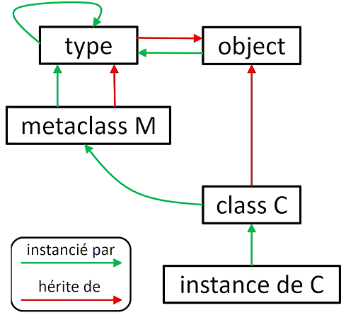

# Semaine 9. Sujets avancés

Ce qu'il faut connaitre :

* 111

[TOC]

## 9.1 Méthodes statiques et de classe

Lorsqu'on avait introduit la notion de classe, nous avions présenté la notion de méthode. Une méthode est conçue pour travailleur sur les attributs des instances. Cependant, nous avions vu qu'il y'avait une <span style="color:darkgreen">**asymétrie**</span> entre la manière d'appeler cette méthode depuis une classe et la manière d'appeler cette méthode depuis une instance.

On appelle une méthode depuis une classe, ce qui est classique. Mais, lorsqu'on l'appelle depuis une instance, il s'agit d'une ```méthode bound```. Python va automatiquement passer à cette méthode comme première argument, l'instance qui l'appelle. C'est exactement le comportement que l'on veut dans le cas classique, puisque en général, on veut travailler sur les attributs des instances.

Cependant, on pourrait imaginer vouloir travailler sur les **attributs de classe** par exemple. Ce qui ne sera pas possible.

Il y'a deux techniques pour résoudre ce problème :

* Les méthodes statiques
* Les méthodes de classe

**<u>debut</u>:**

Nous allons essayer de compter le nombre d'instances qui ont été créées par une classe. On peut le faire simplement en rajoutant un compteur dans la classe :

```python
class Phrase:
    nb_i = 0
    def __init__(self):
        Phrase.nb_i += 1
        
>>> Phrase()
<__main__.Phrase object at 0x0000021CB4AA32B0>
>>> Phrase()
<__main__.Phrase object at 0x0000021CB4A7EB00>
# On regarde le compteur d'instance
>>> Phrase.nb_i
2
```

On se dit que ce serait mieux de passer par une méthode plutôt que par l'attribut. On va rajouter une méthode à la classe, qui compte le nombre d'instance.

On voit que tout fonctionne. On remarque qu'à ```num()``` on n'a pas rajouté de paramètre ```self```. C'est parce qu'en fait, une méthode appelée sur une classe est une fonction classique. Donc, Python ne va pas lui passer l'instance comme premier argument.

```python
class Phrase:
    nb_i = 0
    def __init__(self):
        Phrase.nb_i += 1
    def num():
        return Phrase.nb_i
    
>>> Phrase()
<__main__.Phrase object at 0x0000021CB4AA32B0>
>>> Phrase()
<__main__.Phrase object at 0x0000021CB4A7EB00>
>>> Phrase.num()
2
# On vérifie qu'on a bien une fonction classique
>>> Phrase.num
<function Phrase.num at 0x0000021CB4AA49D8>
```

Et si maintenant, on crée une nouvelle instance de Phrase. L'exception est tout à fait normale, car pour rappel, une méthode appelée sur une instance, c'est une ```méthode bound```. Qui va lui  passer ```self``` en premier argument ce qui n'est pas possible.

```python
>>> p = Phrase()
>>> p.num()
Traceback (most recent call last):
  File "<stdin>", line 1, in <module>
TypeError: num() takes 0 positional arguments but 1 was given
```

On est confronté au problème <span style="color:darkgreen">**d'asymétrie**</span> entre appel d'une méthode sur une classe (c'est une fonction classique) et appel d'une méthode sur une instance (```méthode bound```). Dans ce second cas, on aimerait bien avoir une méthode qu'on puisse appeler indifféremment, de la classe ou depuis l'instance. En Python, c'est ce qu'on appelle <span style="color:darkgreen">**méthode statique**</span>. On la définit avec un <span style="color:darkblue">**décorateur**</span> ```@staticmethod```.

```python
class Phrase:
    nb_i = 0
    def __init__(self):
        Phrase.nb_i += 1
        
    @staticmethod
    def num():
        return Phrase.nb_i
```

Une méthode statique, c'est une méthode qu'on pourra appeler indifféremment, depuis une classe ou depuis une instance. Si on l'appelle depuis une classe ce sera une fonction classique. Si on l'appelle depuis une instance, ce sera de nouveau une fonction classique.

Exécutons ce  code :

```python
>>> p = Phrase()
>>> Phrase.num()
1
>>> p.num()
1
```

**<u>Ajout d'une sous classe</u>:**

Une sous-classe d'une classe qui a une méthode statique hérite, automatiquement, de cette méthode statique. Par contre, si on surcharge cette méthode statique dans la sous-classe, il faudra, évidemment, la redéfinir comme méthode statique, regardons cela :

```python
class PhraseSansCasse(Phrase):
    pass

>>> p = Phrase()
>>> Phrase.num()
2
>>> # On peut appeler la méthode statique depuis une sous classe
>>> PhraseSansCasse.num()
2
```

On va voir ce qu'il se passe si on surcharge la méthode ```num()``` qui est défini dans la super classe. Il ne faut pas oublier de la redéfinir comme méthode statique, sinon ça redeviendra une méthode normale.

```python
class PhraseSansCasse(Phrase):
    @staticmethod
    def num():
        return f"PhraseSansCasse {Phrase.nb_i}"
>>> p = Phrase()
>>> Phrase.num()
3
>>> PhraseSansCasse.num()
"PhraseSansCasse 1"
```

**<u>Limitations - Proposition 1</u>:**

Le compteur dans ```__init__``` est incrémenté, à chaque fois que je crée une instance de ```PhraseSansCasse```. Mais il n'y a aucune distinction entre les deux classes, nous n'avons qu'un unique compteur.

*:*

```python
class PhraseSansCasse(Phrase):
    nb_i = 0
    def __init__(self):
        PhraseSansCasse.nb_i += 1
        
    @staticmethod
    def num():
        return f"PhraseSansCasse {Phrase.nb_i}"
```

**<u>Limitations: Proposition 2 - Les méthodes de classe</u>:**

Cette solution n'est pas satisfaisante, lorsqu'on va appeler la méthode ```num()```, il n'y aucun moyen de savoir de quelle classe on l'appelle. Il faudrait pouvoir passer à ```l'objet classe``` à la méthode ```num()```. <span style="color:darkgreen">**On peut le faire avec ce qu'on appelle les méthodes de classe**</span>, elle va créer une ```method bound```. Sauf que cette fois ci cette méthode ne sera pas liée à l'instance, mais sera liée à la classe qui l'appelle

<span style="color:darkblue">**Cette méthode de classse qu'on appelle depuis une instance ou depuis une classe passera automatiquement la classe comme premier argument de la méthode**</span>.

On va remplacer par ```@staticmethod``` on va passer un argument ```classe (cls)```, puisque, maintenant la méthode est définie comme une ```method bound``` à la classe. Donc, ici, au lieu de lui passer ```Phrase``` on va directement lui passer la classe (cls). Si c'est une méthode appelée, depuis la classe ```PhraseSansCasse``` ou depuis une instance de ```PhraseSansCasse```, c'est le compteur de ```PhraseSansCasse``` qui sera appelé. Si la méthode est appelée, depuis une instance de Phrase ou depuis, directement la classe Phrase, ce sera le compteur de Phrase qui sera appelé.

```python
class Phrase:
    nb_i = 0
    def __init__(self):
        Phrase.nb_i += 1
   
    @classmethod
    # cls = classe
    def num(cls):
        return cls.nb_i

# on va surcharger la methode num 
class PhraseSansCasse(Phrase):
    nb_i = 0
    def __init__(self):
        PhraseSansCasse.nb_i += 1
        
    @classmethod
    def num(cls):
        return f"PhraseSansCasse {cls.nb_i}"
```

On peut évaluer ce code :

```python
>>> p = Phrase()
>>> Phrase()
<__main__.Phrase object at 0x000001F83B7964A8>
>>> p_no = PhraseSansCasse()
>>> p.num()
2
>>> Phrase.num()
2
# On a bien deux méthodes bound
>>> Phrase.num
<bound method Phrase.num of <class '__main__.Phrase'>>
>>> p.num
<bound method Phrase.num of <class '__main__.Phrase'>>
# Dans PhraseSansCasse on a bien que "un count"
>>> p_no.num()
'PhraseSansCasse 1'
>>> PhraseSansCasse.num()
'PhraseSansCasse 1'
```

**<u>Conclusion</u>:**

Nous venons de voir les notions de méthodes statiques et de méthodes de classe. Une méthode statique est une méthode que l'on peut appeler indifféremment, depuis une classe ou depuis une instance, et ça a créé une méthode qui se comporte comme une fonction tout à fait classique.

Et une méthode de classe, c'est une méthode qui s'appelle indifféremment, depuis une classe ou depuis une instance, mais qui va être ```bound``` à la classe, par conséquent, l'interpréteur va automatiquement passer la classe comme premier argument.


## 9.2 Les décorateurs

### 9.2.1 XXX

Lorsqu'on développe des fonctions, il arrive que l'on ait un même besoin sur plusieurs fonctions. Par exemple, calculer un temps d'exécution, valider des arguments, ou compter le nombre d'appels que l'on fait de ces fonctions (ce qu'on sait déjà implémenter).

Le problème que l'on aurait, c'est qu'on dupliquerait beaucoup de code puisqu'il faudrait écrire un code spécifique, pour chaque fonction, alors que ce code fait la même chose.

Un décorateur est une manière de dire explicitement, que l'on modifie le comportement d'une fonction. Ce qui permet de factoriser un code. **Un décorateur permet d'exécuter du code avant l'appel d'une fonction, après l'appel d'une fonction, et éventuellement de garder des informations entre plusieurs appels successifs d'une fonction**. On verra qu'en fait ça peut être encore plus générale que ça.

La notation est :

```python
@decorateur
def f():
    pass
f()

# !!!! Equivalent à !!!!!
def f()
	pass
f = decorateur(f)
f()
```

Le point clef a retenir est ```f``` n'est plus la fonction mais l'objet retourné par ```decorateur(f)```. Il faut introduire la notion de <span style="color:darkgreen">**Callable**</span>.

On reprend notre ancien exemple :

```python
class C:
    @classmethode
    def f(c):
        pass
    @staticmethod
    def g():
        pass
    ...
# !!!! Equivalent à !!!!!
class C:
    def f(c):
        pass
    def g():
        pass
    ...
    f = classmethod(f)
    g = staticmethod(g)
```

Nous voyons la supériorité de cette notation décorateur. Car c'est important de pouvoir spécifier, lorsqu'on déclare une fonction, que le comportement de la fonction est modifié. En effet, déclarer une méthode comme statique ou de classe est une modification fondamentale du comportement de la fonction. Avec les notations de décorateurs, on peut vraiment lier cette modification de comportement, au moment de la déclaration de la fonction.

**<u>Qu'est ce qu'un Callable</u>?**

C'est un objet que l'on peut appeler avec ```O()``` le ```O``` est le nom de l'objet. Ce qui correspond à ce qu'on connait comme étant une fonction. Une fonction, évidemment, est Callable, mais également une instance, dont la classe implémente la méthode ```__call__```

**<u>Qu'est ce qu'un Décorateur (avec notion de Callable)</u>?**

Un décorateur c'est un Callable qui prend comme argument une fonction et qui retourne, de nouveau, un callable.

```python
# "decorateur" est un callable : il prend une fonction en argument
f = decorateur(f)
# Il retourne un callable qu'on peut appeler
f(a, b)
```

**<u>Exemple</u>:**

On veut construire un décorateur ```NbAppel``` dont le but est de compter le nombre d'appels, qu'on fait sur notre fonction.

la fonction ```f``` est la fonction qu'on veut décorer. Pour qu'une instance de classe soit callable on doit lui créer une méthode ```__call__``` 


Pour résumer, ```f=NbAppel(f)```, ```f``` n'est plus une fonction, mais c'est une instance de ```NbAppel``` et chaque instance de ```NbAppel``` va avoir son propre compteur, ce qui veut dire que mon décorateur on peut l'appliquer à n'importe quelle fonction.

Chaque application décorateur va créer une nouvelle instance et ```f(NbAppel)``` va, en fait, appeler la méthode ```__call__``` sur cette instance. Ensuite, on voit que la méthode va retourner, après avoir incrémenté le compteur, un appel de la fonction originale.

Essentiellement, le décorateur va compter le nombre d'appels, et ensuite, exécuter la fonction tout à fait normalement. Regardons cela

```python
>>> f(1, 2)
f : 1 appels
1 2 
>>> f(3, 'a')
f : 2 appels
3 a
# On peut appliquer le décorateur à une nouvelle fonction
# Ceci va créer une nouvelle instance, avec son propre compteur.
>>> @NbAppel
>>> def g(a, b, c):
...    print(a, b, c)
>>> g(1, 2, 3)
g : 1 appels
1 2 3
```

### 9.2.2 Extensions


## 9.3 Les clôtures de fonctions

Nous avons vus que nous pouvions implémenter un décorateur sous forme d'une classe. Cependant, on sait que un décorateur est un Callable qui retourne un Callable, ce qui veut dire qu'on pourrait très bien implémenter un décorateur sous forme d'une fonction qui retourne une fonction.

Pour cela on utilise une technique qui s'appelle **la clôture**. Avant nous devons voir ce qu'est une **variable libre** en Python. On dit **qu'une variable est libre** si elle n'est **ni locale ni globale**, essentiellement, une variable libre c'est une variable qui est contenu dans une fonction englobante.

En Python on dit qu'on a une clôture ou qu'une fonction est une clôture lorsqu'on a une fonction qui référence des variables libres.

Voyons ça :

On dit que ```y``` est une variable libre, donc la fonction ```incremente()``` est une clôture. 

```python
def plus_n(y):    
    def incremente(x):
        return x + y 
    return incremente
```

On va définir une nouvelle variable, qui va retourner ```incremente()``` qui garde un lien vers la variable libre. Donc à chaque fois qu'on appellera cette fonction on aura le paramètre ```y``` qui sera défini.

Cette variable contient la méthode spéciale ```__closure__```, il renvoi un tuple qui garde les références vers les variables libres. On peut lire le premier élément

```python
>>> plus3 = plus_n(3)
>>> plus3(10)
13
>>> plus3.__closure__
(<cell at 0x000002C01D7DFBE8: int object at 0x00007FFC88E8EF40>,)
# On peut lire le contenu de la première adresse - qui est la variable y
>>> plus3.__closure__[0].cell_contents
3
```

**<u>Implémenter un décorateur en utilisant les clôtures</u>:**

On veut implémenter un décorateur qui permet de calculer le temps d'exécution d'une fonction.

On définit une fonction ```wrapper()``` qui est la clôture

```python
import time
# timer: c'est le décorateur - on va décorer la fonction "f"
# On doit retourner un Callable, ce sera Wrapper
def timer(f):
    def wrapper(*args, **dargs):
        start = time.time()
        res = f{*args, **dargs}
        # On affiche le temps d'exécution
        print('{:.2} s'.format(time.time()-start))
        return res
    return wrapper

@timer
def sum_poly5(n):
    return sum(x**5 for x in range(n))

>>> sum_poly5(1_000_000)
0.47 s
```

**<u>Limitation de la clôture de fonction</u>:**

Elle ne permet pas de modifier les variables libres. En effet, si on fait une affectation localement d'une variable libre, cette variable va devenir une variable locale. Or, on pourrait vouloir la modifié, par exemple, si on prend un compteur qui compte le nombre d'appels d'une fonction. On verra deux techniques pour faire ça.

La méthode ```nonlocal``` et ce qu'on appelle les Attributs de fonction.

**<u>Solution 1 : L'instruction ```nonlocal```</u>:**

On va définir un décorateur qui compte le nombre d'appels à une fonction.

```python
def trace_call(f):
    called = 0
    def wrapper(*args, **dargs):
        # On dit que called n'est plus une variable locale à Wrapper
        # C'est la variable libre défini dans trace_call()
        nonlocal called
        called = called + 1
        print(f'{called} appels de {f.__name__}')
        return f(*args, **dargs)
    return wrapper

@trace_call
def my_func():
    pass

>>> my_func()
1 appels de my_func
>>> my_func()
2 appels de my_func
```

**<u>Solution 2 : Attributs de fonction</u>:**

On remarque qu'on a pas d'attribut ```called``` dans le ```wrapper```, donc l'instruction ligne trois ne devrait pas marcher. Les fonctions étant des objets mutables ont peu les modifier (ce qu'on fait).

On peut rajouter ```wrapper.called = 0``` à la fin 

On peut écrire ```wrapper.called = wrapper.called + 1``` même si il n'est pas défini car on appelle cet attribut uniquement plus loin dans le code avec  ```wrapper.called = 0``` .

```python
def trace_call(f):
    def wrapper(*args, **dargs):
		wrapper.called = wrapper.called + 1
        print(f'{wrapper.called} appels de {f.__name__}')
        return f{*args, **dargs}
    wrapper.called = 0
    return wrapper

@trace_call
def my_func():
    pass

>>> my_func()
1 appels de my_func
>>> my_func()
2 appels de my_func
```

**<u>Comment garder les métadonnées de la fonction décorée</u> ?**

Il faut bien noter que la variable ```f``` ne référence plus la fonction original mais référence un nouvel objet qui s'appelle ```wrapper```. Ce qui veut dire que le nom de cet objet fonction est différent de la fonction original et que tout ce qui est Doc String, par exemple, est également différent.

On reprend l'exemple du ```wrapper``` défini avec la méthode **Attribut de fonction**

```python
@trace_call
def my_func():
    'documentation pour my_func'
    
# Regardons ce qu'il se passe si on appelle help() sur cette fonction
# On voit qu'on a la DocString de wrapper et pas celle qu'on a défini
>>> help(my_func)
Help on function wrapper in module __main__:
wrapper(*args, **dargs)
```

Il existe une technique très simple pour garder les métadonnées du ```wrapper``` avec le module ```functools``` on va décorer notre wrapper

```python
from functools import wraps
def trace_call(f):
    @wraps(f)
    def wrapper(*args, **dargs):
		wrapper.called = wrapper.called + 1
        print(f'{wrapper.called} appels de {f.__name__}')
        return f{*args, **dargs}
    wrapper.called = 0
    return wrapper

@trace_call
def my_func():
    'documentation pour my_func'

# Cette fois-ci on a la bonne documentation
>>> help(my_func)
Help on function wrapper in module __main__:
    
my_func()
	documentation pour my_func
```

Nous venons de voir les décorateurs implémentés sous forme de fonction, nous avions déjà vu ceux implémenté sous forme de classe. On pourrait penser qu'elles sont équivalentes mais il y'a quelques différences surtout en programmation avancés.


## 9.4 Les métaclasses

La métaclasses est l'objet qui va créer toutes les classes en Python. En pratique, elles servent à modifier les objets classes au moment de leurs créations. On pourra, valider des noms de méthodes dynamiquement, générer automatiquement des méthodes, créer des propriétés ou des descripteurs de façons automatique.

En fait, lorsqu'on utilise des grosses librairies il est probable que les métaclasses soient à la manœuvre. Même si on implémente pas soit même des métaclasses, la connaissance du mécanisme de création des objets permettra d'améliorer la compréhension du langage.

Dans cette vidéo nous allons aborder trois objets particuliers : les métaclasses, les classes et les instances. Tout est un objet en Python, mais tous les objets n'ont pas les mêmes propriétés.

**<u>Quelle est la super classe de toutes les classes</u> ?**

C'est la classe ```object``` comme on peut voir :

```python
class C:
    pass
# La superclasse de t est object
>>> t = C.__bases__
>>> t 
(objet,)
# Il n y'a aucune classe au dessus de object
>>> t[0].__bases__
()
>>> object.__bases__
()
```

On le vérifie aussi sur les types builtins

```python
>>> int.__bases__
(object,)
>>> dict.__bases__
(object,)
>>> str.__bases__
(object,)
```

On voit que, si on créer notre propre classe ou qu'on prenne un type builtin ils ont tous la classe ```object``` comme super classe.

**<u>Quelle différence entre classe et instance</u> ?**

* Une classe a pour type <span style="color:darkgreen">**type**</span>.
  * Les classes peuvent avoir des sous-classes, pas les instances
* Une instance a pour type sa classe
  * Les classes peuvent avoir des instances, pas les instances


On revient sur : "le type d'une classe est l'objet <span style="color:darkgreen">**type**</span>"

```python
class C:
    pass
>>> i = C()
# Le type de l'instance i est sa classe C
# Donc on classe i dans la catégorie instance
>>> type(i)
__main__.C
# On classe C dans la catégorie des classes
>>> type(C)
type
```

On regarde avec les types builtins

```python
>>> type(1) # instance
int
>>> type(int) # classe
type
>>> type('a') # instance
str
>>> type(str) # classe
type
```

**<u>Pourquoi le type de toutes les classes est l'objet <span style="color:darkgreen">type</span></u>** ?

Qu'est ce que ça veut dire être le type d'une classe ? Le type est l'objet qui instancie cette classe, donc qui va créer l'objet class.

L'objet **<span style="color:darkgreen">type</span>** instancie toutes les classes en Python, or, par définition un objet qui instancie toutes les classes est ce qu'on appelle une **métaclasse**, donc une métaclasse c'est un objet qui instancie les classes. En Python, on a une seule métaclasse est c'est l'objet **<span style="color:darkgreen">type</span>**.

**<u>Le type d'une classe c'est le type de sa super classe</u> :**

Une propriété importante du type de la métaclasse, c'est qu'en fait le type d'une classe est le type de sa super-classe.

Regardons ça :

```python
>>> class C:
    pass
>>> class D(C): pass
>>> type(object)
type
>>> type(C)
type
# Le type d'une classe c'est le type de sa super classe
>>> type(D)
type
```

**<u>Quel lien entre <span style="color:darkgreen">type</span> et <span style="color:darkred">object</span></u> :**

On a donc deux primitives particulières : - type - Object. Ce sont les premiers objets créée lorsqu'on démarre l'interpréteur, après tout le reste hérite ou est crée à partir de ces deux primitives.

Regardons quel est le liens entre type et Object :

```python
>>> type(object)
type
>>> type.__bases__
(object,)
# type est son propre type, c'est une convention Python
>>> type(type)
type
```

Pour résumer :


**<u>Peut-on écrire nos propres métaclasses pour instancier les classes</u> ?**

Il y'a deux manières d'en créer en Python :

* L'écrire en C : ce qui donne un contrôle total de la création de la mémoire 
* En Python : en créant une classe qui hérite de l'objet **<span style="color:darkgreen">type</span>** ce qui donnera contrôle, pré-instanciation et initialisation de l'objet classe.

Comment la métaclasse crée l'objet classe ?

On compare ce qui est fait par le programmeur et par l'interpréteur, le second va garder en mémoire le nom de la classe, exécuter le bloc de code, créer un dictionnaire (espace de nommage) qui va stocker tout ce qui a été crée, puis, pour finir il va créer avec la fonction builtin ```type``` qui portera le nom de la classe.


Suite de l'interpréteur, on peut se demander, que fait l'appel ```type(name, bases, dict)``` ? Il va appeler la méthode ```__call__``` sur l'objet **<span style="color:darkgreen">type</span>**. L'appel```__ call__``` va appeler une méthode ```new()``` qui va créer l'objet classe et une méthode init qui va instancier cet objet classe.

```python
cls = type.__new__(type, name, bases, dict)
type.__init__(cls, name, bases, dict)
```

```__new__``` crée l'objet classe : Utile pour modifier l'espace de nommage ou les superclasses avant la création de la classe.

```__init__``` initialise l'objet classe : Utile pour modifier la classe après sa création.

**<u>Exemple d'implémentation de métaclasse</u> ?**

Pour créer une métaclasse il faut forcément hériter de ```type```. Cette métaclasse va avoir deux rôles : le premier rôle va être de dire que toutes  les classes qui sont instanciés par cette métaclasse vont automatiquement hériter d'une autre classe. Le deuxième rôle est qu'elle va validé la syntaxe d'une méthode et donc si on a des méthodes qui ont une mauvaise capitalisation elle va le mettre directement en minuscule.

```python
class LowerAttrMetaclass(type):
    def __new__(cls, clsname, bases, dct):
        lowercase_attr = {}
        # On parcourt l'espace de nommage avec items
        for name, val in dct.items():
            # On regarde les méthodes qui ne commencent pas par un double __
            if not name.startswith('__'):
                # on mettra le nom de la méthode en minuscule
                lowercase_attr[name.lower()] = val
        	# Si c'est une méthode spéciale on ne change rien
            lowercase_attr[name] = val
        # BaseOfAll est notre super classe
        bases = (BaseOfAll,) 
        # On a modifié deux élts dans ce qu'on retourne : bases et dct
        return type.__new__(cls, clsname, bases, lowercase_attr)
    
class BaseOfAll:
    def common_func(self):
        return "in common_func"

# On utilise la syntaxe qui permet de définir une métaclasse
class C(metaclass=LowerAttrMetaclass):
    def funC_bAd_CAP(self):
        return "in_func_bad_cap"
```

On exécute le code dans l'interpréteur :

```python
>>> c = C()
>>> c.func_bad_cap()
'in_func_bad_cap'
>>> c.common_func()
'in common_func'
```

**<u>Pour résumer</u> :**




## 9.5 Property et descripteurs

Les getters et les setters ont un inconvénient majeurs, et qu'ils ajoutent une complexité lors de l'accès à nos attributs et surtout on doit les implémenter pour tout nos attributs. En Python, nous n'avons pas besoin des getters et setters, à la place on utilise ce qu'on appelle Property et Descripteurs.

On va créer une classe qui permet de contrôler la température qu'on veut mettre dans notre maison.

**<u>Version non recommandé - avec Getters et Setters</u> :**

```python
class Maison:
    def __init__(self, t):
        self._temperature = t
        
	def get_temperature(self):
        return self._temperature
    
    def set_temperature(self, t):
        if 5 < t and t < 25:
            self._temperature = t
            return
        # Sinon on retourne une exception
        raise TemperatureError()
        
class TemperatureError(Exception):
    pass

>>> m = Maison(18)
>>> print(m.get_temperature())
18
>>> m.set_temperature(22)
>>> print(m.get_temperature())
22
>>> m.set_temperature(28)
Traceback (most recent call last):
    File 
TemperatureError
```

**<u>Version 2  - Property</u> :**

```python
class Maison:
    def __init__(self, t):
        # On va modifier dans init : temperarture
        # c'est ce qu'il y'a dans le erratum je suis pas sur
        self.temperature = t
        
	def get_temperature(self):
        return self._temperature
    
    def set_temperature(self, t):
        if 5 < t and t < 25:
            self._temperature = t
            return
        # Sinon on retourne une exception
        raise TemperatureError()
    # On rajoute la property    
	temperature = property(get_temperature,
                           set_temperature)
        
class TemperatureError(Exception):
    pass

>>> m = Maison(18)
>>> m.temperature
18
>>> m.temperature = 22
>>> m.temperature
22
>>> m.temperature = 28
....
TemperatureError
```

**<u>Les descripteurs</u> :**

Le mécanisme que nous venons de voir repose sur les descripteurs qui est beaucoup plus général que les propriétés et plus puissants. Les descripteurs sont des classes tout à fait normale sur laquelle on va définir une méthode spéciale ```__get__```.

```python
class Temperature:
    # Avec cette méthode on respecte le type descripteurs, on a 3 paramètres :
    # self: c'est l'instance du descripteur
    # inst: c'est l'instance de l'objet dans lequel on a mis le descripteur
    # instype: c'est la classe dans lequel on a mis le descripteur
    def __get__(self, inst, instype):
        return inst._temperature
    def __set__(self, inst, t):
        if 5 < t and t < 25:
        	inst._temperature = t
            return
        raise TemperatureError()
        
class TemperatureError(Exception):
    pass

class Maison:
    def __init__(self, t):
        self.temperature = t
    # On créer un descripteur :
    # L'attribut temperature est en fait une instance du descripteur Temperature
    # A chaque fois qu'on va appeler temperature, on va appeler la méthode get
    # pour chaque modification ce sera la méthode set
    temperature = Temperature()
    
>>> m = Maison(18)
>>> m.temperature
18
>>> m.temperature = 22
>>> m.temperature
22
>>> m.temperature = 28
....
TemperatureError
```

On verra que dans la majorité des cas les ```properties``` sont largement suffisantes, on utilisera les ```descripteurs``` uniquement dans les cas les plus sophistiqués.


## 9.6 Protocole d'accès aux attributs

Suite à ce qu'on a vu, nous allons voir un autre mécanisme qui repose sur trois méthodes : ```__getattribute__```, ```__setattr__``` et ```__getattr__``` qui permettent de contrôler l'accès de n'importe quel attribut en Python. Nous **verrons que leurs noms ont été très mal choisi**.

**<u>La méthode ```__getattribute__```</u> :**

Si on implémente cette méthode dans notre classe, nous aurons la certitude que tout les accès à des attributs sur notre instance passeront par cette méthode ```__getattribute__```. Tout les mécanismes de recherche des attributs et en particulier les descripteurs sont implémentés dans la méthode ```__getattribute__``` de l'objet  ```object```.

Donc si on veut garder ce mécanisme on va être obligé d'implémenter une méthode ```obj.__getattribute__(attr)``` dans notre classe.

**<u>La méthode ```__setattr__```</u> :**

C'est la méthode qui sera systématiquement appelé lorsqu'on modifie un attribut. Toute la mécanique de modification des attributs est implémenté avec cette méthode spéciale.

Le nom aurait du être ```__setattribute__``` car **c'est exactement le symétrique de  la méthode ci-dessus**. Mais pour des raisons historiques ils ont choisi ce nom.

**<u>La méthode ```__getattr__```</u> :**

Cette méthode est très différente des deux méthodes ci-dessus. C'est une méthode de la dernière chance. Si on n'implémente pas ```__getattribute__```dans notre classe et si l'attribut qu'on essaye d'accéder n'existe pas dans l'espace de nommage ou le long de l'arbre d'héritage, la méthode ```__getattr__``` va être appelé en dernier ressort.

**<u>Expérimentations</u> :**

On reprend le descripteur température

```python
class Temperature:
    def __get__(self, inst, instype):
        print(f"desc __get__")
        return inst._temperature
    def __set__(self, inst, t):
        print(f"desc __set__ {t}")
        inst._temperature = t

class Maison:
    def __init__(self, t):
        self.temperature = t
    def __getattribute__(self, a):
        print(f"__getattribute__: {a}")
        return object.__getattribute__(self,a)
    def __setattr__(self, a, v):
        # on va modifie l'attribut a
        print(f"__setattr__: {a} = {v}")
        return object.__setattr__(self, a, v)
    temperature = Temperature()
```

On fait une exécution dans l'interpréteur :

```python
# Lorsqu'on fait un retour chariot, on va appeler self.temperature
# On va changer la valeur de l'attribut temperature qui est un descripteur
# On voit que trois méthodes sont appelés (on modifie _temperature à la fin)
>>> m = Maison(18)
__setattr__: temperature = 18
desc __set__ 18
__setattr__: _temperature = 18
# Accédons à l'attribut température
>>> m.temperature
__getattribute__: temperature
desc __get__
__getattribute__: _temperature
18
>>> m.temperature = 22
__setattr__: temperature = 22
desc __set__ 22
__setattr__: _temperature = 22
# On regarde un attribut qui n'existe pas dans mon espace de nommage
>>> m.x
__getattribute__: x
Traceback (most recent call last):
  File "<stdin>", line 1, in <module>
  File "<stdin>", line 6, in __getattribute__
AttributeError: 'Maison' object has no attribute 'x'
# On n'aura pas la logique des descripteurs car 'x' n'est pas implémenté
>>> m.x = 10
__setattr__: x = 10
>>> m.x
__getattribute__: x
10
```

